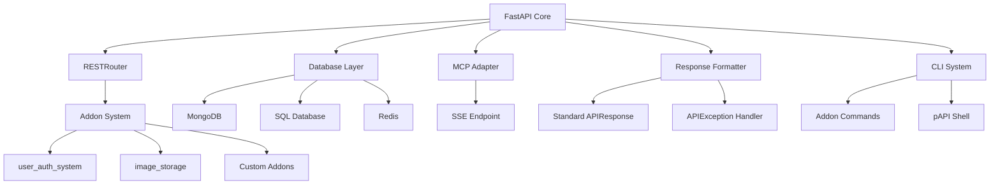

<div align="center">
  
</div>

# pAPI – Python/Pluggable API Framework

**pAPI** (Python API / Pluggable API) is a modular micro-framework built on FastAPI, designed for creating composable, tool-oriented web APIs. It extends FastAPI's routing system with advanced capabilities for agent-based applications and modular service architectures.

> 🚧 **Documentation Notice**: Full documentation is not yet available. This README serves as the primary reference until official documentation is released.


*Example: pAPI modular architecture with core system and addons*

---

## ✨ Key Features

### 🔌 Plug-and-Play Architecture

- Dynamic endpoint registration using `RESTRouter` from `api.core.router`
- Addon dependency resolution and automatic initialization
- Route overriding support for behavior extension
- Discoverable module structure integration
- Fully compatible with FastAPI's async support and high performance

### 🧠 Native MCP Integration

```python
@app.get("/tool", expose_as_mcp_tool=True)
async def my_tool():
    return {"result": "tool output"}
```

- Transform any HTTP endpoint into MCP-compatible tool
- Automatic SSE endpoint exposure (`/sse`)

Example of VSCode copilot agent configuration:

```json
{
  "name": "pAPI",
  "type": "sse",
  "url": "http://localhost:8000/sse"
}
```

### 🧬 Multi-Database Support

| Database | ODM/ORM    | Use Case           |
| -------- | ---------- | ------------------ |
| MongoDB  | Beanie     | Document storage   |
| SQL DBs  | SQLAlchemy | Relational data    |
| Redis    | aioredis   | Caching & sessions |

- Automatic model discovery at startup
- Connections only initialize when relevant models are found
- DB-agnostic design: bring your own database logic
- Transparent connection handling (no manual configuration needed)

> 💡 While the mixed-database architecture allows maximum flexibility, using multiple systems may increase complexity. The choice depends on your application's needs.

### 📦 Standardized API Responses

```python
# Unified response structure
class APIResponse(BaseModel):
    success: bool
    message: Optional[str]
    data: Optional[Any]
    error: Optional[APIError]
    meta: Meta

# Example error handling
raise APIException(
    status_code=status.HTTP_404_NOT_FOUND,
    message="Resource not found",
    code="RESOURCE_NOT_FOUND",
    detail={"resource_id": 123}
)
```

- Consistent error handling via `APIException`
- Automatic metadata injection
- Standardized success/error states across all endpoints

### ⚡ Performance Optimized

- Fully async FastAPI-based engine
- Lazy initialization of components
- Zero-overhead modular structure

### 🛠️ Developer Tooling

```bash
papi_cli start webserver   # Start web server
papi_cli start mcpserver   # Start MCP server
papi_cli shell             # Launch async IPython shell
```

- Extensible CLI system. Addons can register custom CLI commands
- Async-enabled development shell with IPython, to handle models data.

---

## 🧩 Addon System

### Architecture Overview

```
your_extra_addons_path/     # Custom functionality
core/
└── base/
    ├── user_auth_system/   # RBAC+ABAC security
    └── image_storage/      # Image processing
```

### Initialization Hook

Addons implement `AddonSetupHook` for custom startup logic:

```python
from api.core.addon import AddonSetupHook

class Addon(AddonSetupHook):
    async def run(self):
        await initialize_things()
```

### Built-in Addons

| Addon              | Description                         | Technologies              |
| ------------------ | ----------------------------------- | ------------------------- |
| `user_auth_system` | RBAC+ABAC security with permissions | Casbin, SQLAlchemy, Redis |
| `image_storage`    | Image upload/optimization service   | Beanie, Pillow            |

### Configuration Example (`config.yaml`)

```yaml
addons:
  extra_addons_path: "your_extra_addons_path"
  enabled:
    - user_auth_system
    - image_storage
  config:
    user_auth_system:
      allow_registration: true
      security:
        access_token_expire_minutes: 60
        secret_key: "secret_key"
    image_storage:
      image_optimization:
        max_dimension: 2048
        jpeg_quality: 85
```

---

## 🚀 Getting Started

### Installation

```bash
git clone https://github.com/your-repo/papi.git
cd papi
rye sync
rye run python src/papi/papi_cli.py --help
```

---

## 🛠️ Creating an Addon

### 1. Addon Structure
Each addon must follow any python module structure, addons are python modules:
```
your_addon/
├── __init__.py
├── manifest.yaml
├── models.py (optional)
├── routers.py (optional)
└── any_other_files.py
```

### 2. Required manifest.yaml
Every addon must include a `manifest.yaml` file with at least these fields:

```yaml
name: task_queue
version: 1.0.0
description: Background task queue system using Celery
author: pAPI Team

dependencies:
  - user_auth_system  # Other addons this depends on if addon is added as dependencies, the can be imported in the current addon

python_dependencies:
  - "APScheduler>=3.9.0"
```

### 3. Router Registration Example

** adds routers.py or any PY file, the discover system will look for all `RESTRouter` instances and include them in the main router  **

```python
# routers.py
from papi.core.router import RESTRouter

api_router = RESTRouter()

@api_router.get("/status")
async def status_check():
    return {"status": "OK"}
```

Then import in `__init__.py`:
```python
from .routers import api_router
```

### 4. Database Models
For Beanie (MongoDB) models:

**models.py**
```python
from beanie import Document

class Person(Document):
    name: str
    
    class Settings:
        name = "persons"  # Collection name
```

The system will automatically:
- Discover models when imported in `__init__.py` by searching for beanie document clases, bases for SQL alchemy
- Initialize database connections
- Create collections/tables if needed

### 5. A Complete Addon Example
**File structure:**
```
weather_addon/
├── __init__.py
├── manifest.yaml
├── models.py
└── routers.py
```

**manifest.yaml:**
```yaml
name: weather
version: 1.0.0
description: Weather data API
author: Your Name

dependencies:
  - user_auth_system

python_dependencies:
  - "requests>=2.28.0"
```

**models.py:**
```python
from beanie import Document

class WeatherStation(Document):
    name: str
    location: dict
    last_reading: float
    
    class Settings:
        name = "weather_stations"
```

**routers.py:**
```python
from papi.core.router import RESTRouter
from papi.core.response import create_response

# load user_auth_system tools from addons dependencies 
from user_auth_system.security.dependencies import permission_required
from user_auth_system.security.enums import PolicyAction

from .models import WeatherStation

router = RESTRouter()

@router.get("/stations",
    dependencies=[permission_required(PolicyAction.READ, required_roles=["user"])],
)
async def list_stations():
    """
    Only authenticated user with role usr can access this endpoint
    """
    stations = await WeatherStation.find_all().to_list()
    return create_response(data=stations)
```

**__init__.py:**
```python
from .routers import router
from .models import WeatherStation

__all__ = ["router"]  # Explicit exports
```

> 💡 **Pro Tip**: The addon system will automatically:
> - Discover and mount all routers
> - Initialize database models
> - Install Python dependencies
> - Verify addon dependencies
> - Run any `AddonSetupHook` implementations

---

## 📊 Use Cases

1. **AI Agent Tooling**  
   Expose MCP-compatible tools for LLM agents with standard response formatting.

2. **Modular Microservices**  
   Build independent, composable services with unified interfaces.

3. **Workflow Automation**  
   Develop task-based APIs for orchestrated pipelines.

4. **Rapid Prototyping**  
   Launch experiments quickly with self-contained addons.

---

## 📊 Architecture Diagram



---

## 🤝 Contributing

1. Fork the repository
2. Create a feature branch (`git checkout -b feature/your-feature`)
3. Commit changes (`git commit -am 'Add feature'`)
4. Push branch (`git push origin feature/your-feature`)
5. Open a Pull Request

---

## 🪪 License

MIT License © 2025 — Eduardo Miguel Firvida Donestevez